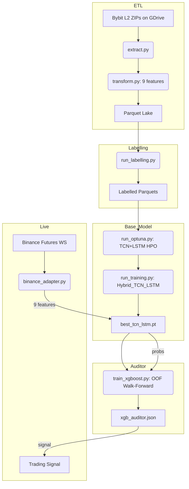

# 🧠 QuantGod Cloud

> **Branch:** `tcn_lstm` | **Status:** 🟢 Active Development

QuantGod is an autonomous market analysis system that predicts BTCUSDT price direction using a **Hybrid TCN+LSTM + XGBoost ensemble** trained on Bybit L2 orderbook microstructure data.

## 🏛️ System Architecture



## 🗺️ Master Index

| Document | Description |
|:---|:---|
| [1. Setup & Env](docs/1_SETUP_AND_ENV.md) | Hardware, CUDA, RunPod, rclone  |
| [2. Data Collection](docs/2_DATA_COLLECTION.md) | Bybit L2 ZIP downloads |
| [3. Data Engineering](docs/3_DATA_ENGINEERING.md) | ETL: 9 stationary features |
| [5. Labelling Strategy](docs/5_LABELING_STRATEGY.md) | Threshold logic, label distribution |
| [7. Operational Manual](docs/7_OPERATIONAL_MANUAL.md) | RunPod execution guide |
| [TCN+LSTM Architecture](docs/TCN_LSTM.md) | Full model architecture & constraints |

## 🚀 Execution Order (RunPod)

```bash
# 1. ETL
python -m src.cloud.base_model.pre_processamento.orchestration.run_pipeline

# 2. Labelling
python -m src.cloud.base_model.labelling.run_labelling

# 3. Hyperparameter Optimization
python -m src.cloud.base_model.otimizacao.run_optuna

# 4. Base Model Training
python -m src.cloud.base_model.treino.run_training

# 5. XGBoost Auditor (OOF Walk-Forward)
python -m src.cloud.auditor_model.train_xgboost

# 6. Live Inference
python src/cloud/auditor_model/binance_adapter.py
```

## 🩺 Status

| Module | Status |
|:---|:---|
| ETL Pipeline | 🟢 Validated (1,129 files) |
| Labelling | 🟢 Operational |
| Base Model (TCN+LSTM) | 🟡 Awaiting Optuna run |
| XGBoost Auditor | 🟡 Awaiting base model |
| Binance Adapter | 🟡 Ready (needs live test) |
