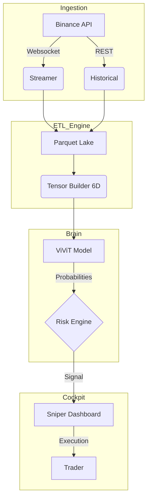

# 🧠 QuantGod: The Bible

> **Version**: 1.0 (The Quant God Edition)  
> **Philosophy**: "The Market is not a 2D line; it is a 6D topography shaped by Order Flow and Noise."  
> **Status**: 🟢 Hedge Fund Grade (Operational)

## 📜 Commandments (Elevator Pitch)
QuantGod is an autonomous high-frequency market analysis system that treats financial data as a **video stream**. Using a modified **ViViT (Video Vision Transformer)** architecture, it analyzes **6-Dimensional Tensors** (Price, Liquidity, Flow, and Wavelet-Denoised Structures) to predict market movements with "Sniper" precision.

It employs a **Meta-Labeling** strategy, where a primary Deep Learning model identifies patterns, and a secondary logic (or future XGBoost) vets them based on hierarchical risk/reward rules.

## 🏛️ System Architecture

---

## 🗺️ Master Index (The Atlas)

| Document | Description | Target Audience |
|:---|:---|:---|
| **[1. Setup & Infrastructure](docs/1_SETUP_AND_ENV.md)** | Hardware requirements, CUDA installation, and Environment secrets. | DevOps / Engineers |
| **[2. Data Collection (Ingestion)](docs/2_DATA_COLLECTION.md)** | Manual for `historical.py` and `stream.py`. How we drink from the firehose. | Data Engineers |
| **[3. Data Engineering (ETL)](docs/3_DATA_ENGINEERING.md)** | The anatomy of **6D Tensors**, Wavelet Math, and Meta-Features. | Quants / Data Scientists |
| **[4. Model Architecture (Brain)](docs/4_MODEL_ARCHITECTURE.md)** | Deep dive into `SAIMPViViT`. Attention mechanisms and tensor shapes. | AI Researchers |
| **[5. Labeling Strategy (Rules)](docs/5_LABELING_STRATEGY.md)** | The "Triple Barrier" logic, Hierarchical Labels, and Meta-Labeling. | Quant Traders |
| **[6. Training Lifecycle (MLOps)](docs/6_TRAINING_LIFECYCLE.md)** | How to train, validate, and manage checkpoints (`.pth`). | MLOps Engineers |
| **[7. Operational Manual (Cockpit)](docs/7_OPERATIONAL_MANUAL.md)** | How to run the Dashboard (`app.py`), interpret signals, and audit the bot. | Traders / Operators |
| **[Repo Map](docs/REPO_MAP.md)** | A complete file-by-file atlas of the codebase. | Developers |

---

## 🩺 System Health & Status

| Module | Status | Version | Notes |
|:---|:---|:---|:---|
| **Ingestion** | 🟢 Active | v1.0 | Supports Multiplexed Streams & Auto-Recovery. |
| **ETL Engine** | 🟢 Active | v1.0 | **6D Tensors** + **Wavelet Denoising** implemented. |
| **Model (ViViT)** | 🟢 Ready | v1.0 | Updated for 6 Channels & 4 Output Classes. |
| **Meta-Labeling** | 🟢 Active | v1.0 | Hierarchical Logic (Stop/SuperLong/Long) active. |
| **Dashboard** | 🟢 Stable | v1.0 | Real-time visualization with Anti-Spoofing layers. |

---

> *Decoding the Matrix.* 🐺🚀
