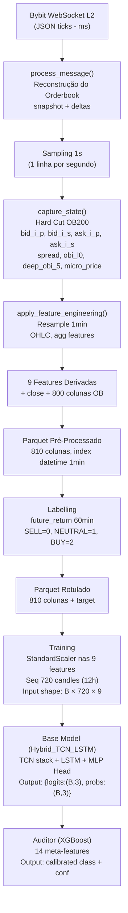

# 📊 QuantGod — Referência Técnica de Dados
**Documento de referência para engenheiros de dados e desenvolvedores construindo sistemas que consomem os mesmos inputs que o modelo QuantGod.**

---

## 1. Fonte dos Dados Brutos (Raw L2)

### 1.1 Origem
- **Exchange**: Bybit (BTC/USDT Perpetual Futures)
- **Tipo de dado**: L2 Order Book — captura completa de profundidade via WebSocket
- **Formato de armazenamento**: Arquivos ZIP mensais contendo arquivos JSON/data, armazenados no Google Drive (`drive:PROJETOS/BTC_USDT_L2_2023_2026`)
- **Nomenclatura de pasta**: Organizado em subpastas por ano (2023, 2024, 2025, 2026)

### 1.2 Estrutura de Cada Mensagem JSON Bruta
Cada arquivo dentro do ZIP contém uma sequência de mensagens JSON, de dois tipos:

#### Tipo `snapshot` (Mensagem de Estado Inicial)
```json
{
  "type": "snapshot",
  "ts": 1704067200000,
  "data": {
    "b": [["43100.5", "1.234"], ["43100.0", "0.890"], ...],
    "a": [["43101.0", "2.100"], ["43101.5", "0.456"], ...]
  }
}
```

#### Tipo `delta` (Mensagem de Atualização Incremental)
```json
{
  "type": "delta",
  "ts": 1704067200150,
  "data": {
    "b": [["43100.5", "0.000"], ["43099.0", "5.000"]],
    "a": [["43102.0", "1.500"]]
  }
}
```

| Campo | Tipo | Descrição |
|:---|:---|:---|
| `type` | string | `"snapshot"` (estado completo inicial) ou `"delta"` (atualização incremental) |
| `ts` | int (ms) | Timestamp Unix em **milissegundos** |
| `data.b` | list of [string, string] | Lista de níveis de Bid: `[preço, quantidade]` |
| `data.a` | list of [string, string] | Lista de níveis de Ask: `[preço, quantidade]` |

> [!IMPORTANT]
> Um tamanho (`quantidade`) igual a `"0.000"` em uma mensagem `delta` significa **remoção** do nível de preço, não um nível com tamanho zero.

---

## 2. OB200 vs OB500 — Profundidade do Orderbook

### 2.1 Contexto Histórico
Os dados brutos Bybit passaram por mudança de profundidade ao longo dos anos:

| Período | Profundidade Original |
|:---|:---|
| 2023 | OB500 (500 níveis de bid + 500 de ask) |
| 2024–2026 | OB200 (200 níveis de bid + 200 de ask) |

### 2.2 Hard Cut 200 (Normalização)
O pipeline aplica um **Hard Cut** automático para **exatamente 200 níveis** em ambos os lados. Isso garante:
- Que arquivos OB500 (2023) e OB200 (2024+) produzam **estrutura de colunas idêntica** no output.
- Que o modelo receba sempre a **mesma dimensionalidade**, independente do período dos dados.
- Os top 200 bids (preços decrescentes) e top 200 asks (preços crescentes) são mantidos.

> [!NOTE]
> **Por que 200?** O nível 200 captura liquidez suficiente para análise de pressão de mercado sem o ruído de níveis extremamente profundos. Níveis abaixo de 200 têm impacto marginal ínfimo na dinâmica de curto prazo analisada pelo modelo.

**Lógica de captura (código fonte `transform.py`):**
```python
sorted_bids = sorted(self.bids_book.keys(), reverse=True)[:200]  # Top 200 bids, ordem decrescente
sorted_asks = sorted(self.asks_book.keys())[:200]                 # Top 200 asks, ordem crescente
```

---

## 3. Timeframe dos Dados e Processo de Amostragem

### 3.1 Frequência Bruta (Ticks)
- As mensagens WebSocket chegam como **ticks em tempo real**, com granularidade de **milissegundos** (o campo `ts` é Unix em ms).
- A frequência real varia com a atividade do mercado (pode ser várias mensagens por segundo).

### 3.2 Amostragem Temporal — 1 segundo
O `L2Transformer` aplica **sampling temporal de 1000ms**:

```python
self.sampling_ms = 1000  # Configurado em cloud_config.yaml → etl.sampling_interval_ms
```

**Lógica:**
- O orderbook interno é mantido em memória e atualizado a cada tick.
- A cada vez que `ts - last_sample_ts >= 1000ms`, uma **fotografia (snapshot)** do estado atual do orderbook é capturada.
- O timestamp de captura é **alinhado à janela**: `(ts // 1000) * 1000`.
- Isso produz **aprox. 1 linha por segundo** por arquivo ZIP.

### 3.3 Reamostragem — 1 Minuto (Timeframe Final do Modelo)
Após a fase de tick-sampling, o método `apply_feature_engineering()` aplica **resampling para 1 minuto**:

```python
df.resample('1min').agg(agg_map)
```

| Coluna Intermediária | Função de Agregação 1min |
|:---|:---|
| `micro_price` → OHLC | `ohlc()` → gera `open, high, low, close` |
| `micro_price` | `std` → `volatility` (desvio padrão da micro-price no minuto) |
| `spread` | `max` → `max_spread` (spread máximo no minuto) |
| `obi_l0` (OBI top) | `mean` → `mean_obi` |
| `deep_obi_5` (OBI top 5) | `mean` → `mean_deep_obi` |
| `bid_{i}_p`, `bid_{i}_s`, `ask_{i}_p`, `ask_{i}_s` | `last` → estado do book no **fechamento** de cada minuto |
| `tick_count` | `sum` → contador de ticks no minuto (base para `log_volume`) |

> [!IMPORTANT]
> **O timeframe efetivo de análise do modelo é 1 minuto.** Cada linha no arquivo Parquet pré-processado representa 1 candle de 1 minuto do orderbook de BTC/USDT Perpetual Futures.

---

## 4. Colunas dos Dados Pré-Processados (Output do ETL)

Os arquivos Parquet produzidos pelo ETL (`data/L2/pre_processed/*.parquet`) possuem **810 colunas** no total.

### 4.1 Tabela de Colunas
| Grupo | Padrão de Nome | Qtd | Descrição |
|:---|:---|:---|:---|
| **Orderbook Bids** | `bid_{i}_p` | 200 | Preço do i-ésimo nível de Bid (i=0 é o best bid) |
| **Orderbook Bids** | `bid_{i}_s` | 200 | Quantidade (size) do i-ésimo nível de Bid |
| **Orderbook Asks** | `ask_{i}_p` | 200 | Preço do i-ésimo nível de Ask (i=0 é o best ask) |
| **Orderbook Asks** | `ask_{i}_s` | 200 | Quantidade (size) do i-ésimo nível de Ask |
| **Features Derivadas** | *(ver seção 5)* | 9 | Features de treinamento calculadas no resampling |
| **Referência de Preço** | `close` | 1 | Micro-price de fechamento do candle de 1min |
| **TOTAL** | | **810** | |

**Exemplo de nomes de colunas de orderbook:**
```
bid_0_p, bid_0_s, bid_1_p, bid_1_s, ..., bid_199_p, bid_199_s
ask_0_p, ask_0_s, ask_1_p, ask_1_s, ..., ask_199_p, ask_199_s
```

### 4.2 Index do Parquet
O índice do DataFrame (e do arquivo Parquet) é `datetime` — timestamps em UTC com frequência de 1 minuto.

---

## 5. Features Derivadas — Cálculo Detalhado

As 9 features derivadas são as **únicas colunas usadas como input direto pelo modelo de treinamento**. Elas são calculadas sobre os dados já reamostrados em 1 minuto.

### 5.1 Features de Candle (Forma/Estrutura)

#### `body` — Retorno Logarítmico do Corpo da Vela
```python
body = np.log(close / open)  # log(fechamento / abertura)
```
- Captura o **movimento líquido** dentro do candle (positivo = candle de alta, negativo = queda).
- Usa logaritmo para garantir simetria e estacionariedade.

#### `upper_wick` — Sombra Superior Normalizada
```python
upper_wick = (high - max(open, close)) / prev_close
```
- Normalizado pelo fechamento do candle **anterior** para manter escala consistente ao longo do tempo.
- Representa a **rejeição de preço** na parte superior da vela.

#### `lower_wick` — Sombra Inferior Normalizada
```python
lower_wick = (min(open, close) - low) / prev_close
```
- Normalizado pelo fechamento do candle anterior.
- Representa a **rejeição de preço** na parte inferior da vela.

### 5.2 Features de Retorno

#### `log_ret_close` — Log-Retorno do Fechamento
```python
log_ret_close = np.log(close / prev_close)
```
- Retorno logarítmico entre o fechamento atual e o fechamento do candle anterior.
- Produz série **estacionária** (apta para modelos de ML sem diferenciação adicional).

### 5.3 Features de Microestrutura do Orderbook

#### `volatility` — Volatilidade Intra-Candle
```python
volatility = std(micro_price)  # desvio padrão da micro_price nos segundos dentro do minuto
```
- Calculado como o **desvio padrão dos ticks de 1s** que compõem cada candle de 1min.
- Captura turbulência de preço dentro de cada minuto.

#### `max_spread` — Spread Máximo no Candle
```python
max_spread = max(spread)  # spread máximo dos ticks de 1s no minuto
```
Onde:
```python
spread = ask_0_p - bid_0_p  # calculado por tick durante o sampling de 1s
```
- Captura **momentos de stress de liquidez** no minuto.

#### `mean_obi` — Order Book Imbalance (Top 1 Nível)
```python
mean_obi = mean(obi_l0)   # média dos OBIs de 1s no minuto
```
Onde:
```python
obi_l0 = (bid_0_s - ask_0_s) / (bid_0_s + ask_0_s)
```
- Range: `[-1, +1]`. Positivo = pressão compradora no topo do book.
- OBI calculado por tick e depois **médio** por minuto.

#### `mean_deep_obi` — Order Book Imbalance Profundo (Top 5 Níveis)
```python
mean_deep_obi = mean(deep_obi_5)  # média dos deep OBIs de 1s no minuto
```
Onde:
```python
bid_vol_5 = sum(bid_0_s ... bid_4_s)
ask_vol_5 = sum(ask_0_s ... ask_4_s)
deep_obi_5 = (bid_vol_5 - ask_vol_5) / (bid_vol_5 + ask_vol_5)
```
- Similar ao `mean_obi` mas usa os **5 melhores níveis** de cada lado, capturando liquidez mais representativa.

#### `log_volume` — Volume Logarítmico (Proxy de Atividade)
```python
log_volume = np.log1p(tick_count)
```
Onde `tick_count` é o **número de mensagens L2 recebidas** no minuto (snapshot + deltas).
- Usado como proxy de volume e atividade de mercado (dados L2 não contêm trade volume diretamente).

---

## 6. Micro-Price — Variável Auxiliar (não é input direto)

A **micro-price** é um preço ponderado pelo tamanho dos top bids e asks:
```python
micro_price = (bid_0_p * ask_0_s + ask_0_p * bid_0_s) / (bid_0_s + ask_0_s)
```
- Representa o **preço justo de curtíssimo prazo**, ponderando a pressão de cada lado do book.
- Usada para gerar OHLC (open/high/low/close) durante o resampling de 1min.
- A coluna `close` no Parquet é a micro-price de fechamento do minuto.
- `micro_price` **não é passada diretamente ao modelo** — apenas suas transformações derivadas (`body`, `upper_wick`, `lower_wick`, `log_ret_close`, `volatility`).

---

## 7. Inputs Diretos do Modelo (QuantGodModel)

### 7.1 Feature Columns (9 colunas)
O modelo recebe **exclusivamente estas 9 colunas** como input:

```python
feature_cols = [
    'body',           # Retorno log do corpo da vela
    'upper_wick',     # Sombra superior normalizada
    'lower_wick',     # Sombra inferior normalizada
    'log_ret_close',  # Log-retorno do fechamento
    'volatility',     # Desvio padrão intra-candle da micro-price
    'max_spread',     # Spread máximo no minuto
    'mean_obi',       # OBI médio (top 1 nível)
    'mean_deep_obi',  # OBI médio (top 5 níveis)
    'log_volume'      # Log do count de ticks L2
]
```

### 7.2 Shape do Tensor de Input
```
Input Tensor Shape: (Batch, Seq_Len, 9)
```
Onde:
- **Batch**: tamanho do batch (configurável: 32, 128, 256, 512 para fine-tuning)
- **Seq_Len**: **720** candles de 1 minuto = **12 horas** de histórico
- **9**: as 9 feature columns acima

### 7.3 Normalização dos Inputs
Antes de entrar no modelo, as 9 features são normalizadas com **StandardScaler** (Z-Score):
```python
scaler = StandardScaler()
scaler.fit(X_raw[:split_idx])  # Fit apenas no conjunto de treino (sem data leakage)
X_norm = scaler.transform(X_raw)
```
O scaler treinado é salvo em `data/models/scaler_finetuning.pkl`.

---

## 8. Rotulagem (Target Variable)

### 8.1 Lógica de Rotulagem
O target é calculado a partir do **retorno cumulativo futuro** da coluna `log_ret_close`:

```python
future_return = rolling_sum(log_ret_close, window=lookahead).shift(-lookahead)
```

Em seguida, thresholds assimétricos são aplicados:
```python
target = 2   if future_return  > threshold_long    # BUY
target = 0   if future_return  < threshold_short   # SELL
target = 1   # otherwise                           # NEUTRAL
```

### 8.2 Parâmetros de Rotulagem (Configuração Atual)
| Parâmetro | Valor | Descrição |
|:---|:---|:---|
| `lookahead` | 60 candles | Janela de 60 minutos (1 hora) à frente |
| `threshold_long` | `+0.008` (~+0.8%) | Retorno mínimo para sinal de COMPRA |
| `threshold_short` | `-0.004` (~-0.4%) | Retorno máximo para sinal de VENDA |

> [!IMPORTANT]
> Os thresholds são **assimétricos por design** — compras exigem retorno esperado 2x maior que vendas. Isso reflete a assimetria de risco/retorno do mercado de futuros de BTC.

### 8.3 Classes do Target
| Valor | Classe | Condição |
|:---|:---|:---|
| `0` | **SELL** | `future_return < -0.4%` em 60 min |
| `1` | **NEUTRAL** | `-0.4% <= future_return <= +0.8%` em 60 min |
| `2` | **BUY** | `future_return > +0.8%` em 60 min |

---

## 9. Colunas das Features vs. Colunas Auxiliares

### Resumo Completo

| Coluna | Tipo | Usado como Input? | Usado para gerar input? | Como? |
|:---|:---|:---|:---|:---|
| `body` | Derivada | ✅ Sim (input direto) | — | `log(close / open)` |
| `upper_wick` | Derivada | ✅ Sim (input direto) | — | `(high - max(open,close)) / prev_close` |
| `lower_wick` | Derivada | ✅ Sim (input direto) | — | `(min(open,close) - low) / prev_close` |
| `log_ret_close` | Derivada | ✅ Sim (input direto) | ✅ Sim (gera target) | `log(close / prev_close)` |
| `volatility` | Derivada | ✅ Sim (input direto) | — | `std(micro_price)` por minuto |
| `max_spread` | Derivada | ✅ Sim (input direto) | — | `max(ask_0_p - bid_0_p)` por minuto |
| `mean_obi` | Derivada | ✅ Sim (input direto) | — | `mean((bid_0_s - ask_0_s) / (bid_0_s + ask_0_s))` |
| `mean_deep_obi` | Derivada | ✅ Sim (input direto) | — | `mean(deep_obi_5)` dos 5 melhores níveis |
| `log_volume` | Derivada | ✅ Sim (input direto) | — | `log1p(tick_count)` |
| `close` | Auxiliar | ❌ Não (input direto) | ✅ Sim (referência) | Micro-price de fechamento |
| `bid_{0..199}_p/s` | Orderbook Raw | ❌ Não (input direto) | ✅ Sim (gera features) | Estado do book no fechamento |
| `ask_{0..199}_p/s` | Orderbook Raw | ❌ Não (input direto) | ✅ Sim (gera features) | Estado do book no fechamento |
| `target` | Label | ❌ (y, não é X) | — | Thresholds sobre `future_return` |

---

## 10. Pipeline Completo — Resumo do Fluxo



---

## 11. Informações para Reprodução em Segunda IA

Para uma segunda IA que deve receber os **mesmos dados como input**, as seguintes garantias devem ser satisfeitas:

1. **Mesma fonte de dados**: Bybit L2 Order Book, BTC/USDT Perpetual Futures
2. **Mesma lógica de reconstrução**: snapshot inicial seguido de aplicação incremental de deltas (remoção quando `size==0`)
3. **Mesmo Hard Cut**: Top 200 bids (desc) e top 200 asks (asc)
4. **Mesmo timeframe**: Sampling 1s → Resample 1min
5. **Mesmas 9 features**: calculadas conforme seção 5, na mesma ordem
6. **Mesma normalização**: StandardScaler fit no conjunto de treino, aplicado em treino e validação
7. **Mesmo `seq_len`**: 720 candles (12 horas de histórico)
8. **Mesmo scaler**: Deve usar o `scaler_finetuning.pkl` salvo durante o treino do modelo original para garantir mesma distribuição em inferência em produção
