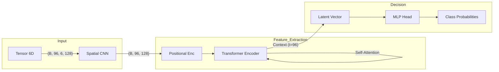

# 🧠 4. Model Architecture (ViViT)

> **Target Audience**: AI Researchers, Quant Developers.

QuantGod uses a modified **Video Vision Transformer (ViViT)**, treating market data as a **spatiotemporal volume**.

---

## 🏗️ Architecture Overview (`QuantGodViViT`)
The model is composed of three main blocks:

### 1. Spatial Feature Extractor (The Eye)
A 1D-CNN that processes each snapshot independently to extract "Spatial" features (Price Levels & Order Flow structure).

- **Input**: `(Batch * Time, 6, 128)`
- **Layers**:
    - `Conv1d(6 -> 32)` + BatchNorm + ReLU + MaxPool
    - `Conv1d(32 -> 64)` + BatchNorm + ReLU + MaxPool
    - `Conv1d(64 -> 128)` + BatchNorm + ReLU + AdaptiveAvgPool
- **Output**: `(Batch * Time, 128)` aka `d_model`.

> **Why Conv1d?** It learns local patterns in the Order Book (e.g., liquidity walls, iceberg orders) before considering time.

### 2. Temporal Encoder (The Memory)
A standard **Transformer Encoder** that learns the sequence of market states.

- **Positional Encoding**: Adds learnable vectors to key timestamps so the model knows "t=0" vs "t=96".
- **Self-Attention**: `nn.TransformerEncoderLayer(d_model=128, nhead=4)`.
    - Allows the model to relate a liquidity spike at `t-20` with a price movement at `t-0`.
- **Output**: `(Batch, Time, 128)`. We take the **Last Hidden State** (`t=-1`) as the final Context Vector.

### 3. Classification Head (The Decision)
A simple MLP that maps the Context Vector to probabilities.

- **Layers**: `Linear(128 -> 64)` -> `ReLU` -> `Dropout(0.1)` -> `Linear(64 -> 4)`.
- **Output**: Logits for 4 classes.

### 📐 Visual Blueprint

---

## 🎛️ Hyperparameters explained
| Param | Value | Description |
|:---|:---|:---|
| `seq_len` | **96** | 24 Hours context (15m candles). Critical for "Eagle View". |
| `input_channels` | **6** | Bids, Asks, OFI Raw, Price Raw, OFI Wavelet, Price Wavelet. |
| `d_model` | **128** | Embedding dimension. Higher = More capacity, Risk of Overfitting. |
| `nhead` | **4** | Number of attention heads. 4 allows attending to Volatility, Trend, Liquidity, and Noise separately. |
| `num_layers` | **2** | Depth of Transformer. kept low to ensure fast inference (HFT readiness). |
| `dropout` | **0.1** | Regularization to prevent memorizing the dataset. |

---

## 🔮 Output Classes
The model outputs a raw vector of size 4.
- Index 0: **NEUTRO** (No trade)
- Index 1: **STOP** (High risk of crash)
- Index 2: **LONG** (Standard Buy)
- Index 3: **SUPER LONG** (High Conviction Buy)

We use **CrossEntropyLoss** with `class_weights` to penalize missing a `SUPER LONG` 20x more than a `NEUTRO`.
