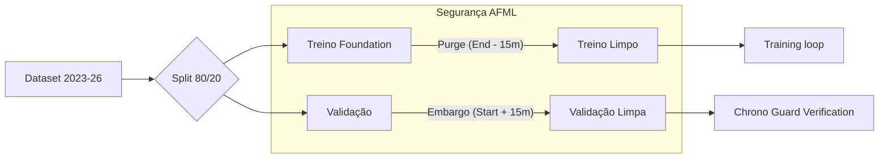

# 🛡️ 4.1 Strict Temporal Split (AFML Standard)

> **Status**: Ativo & Dinâmico (v9.5+)
> **Script:** `src/cloud/base_model/treino/split_dataset.py`
> **Referência:** *Advances in Financial Machine Learning*, Capítulo 7 (Marcos López de Prado).

---

## 🎯 Por que o Split Temporal é Crítico?

Em aprendizado de máquina tradicional, usamos `shuffle` para misturar os dados. No mercado financeiro, isso é um **ERRO FATAL**. Como os dados são séries temporais (uma barra depende da anterior), misturar os dados causa **Data Leakage** (vazamento de informação do futuro para o passado).

O QuantGod v5.0 utiliza um **Strict Out-of-Fold (OOF) Split** que não apenas divide os dados cronologicamente, mas aplica "zonas de silêncio" para garantir que o modelo nunca veja o futuro.

---

## 🎞️ A Estrutura do Split (2023-2026)

O sistema processa o histórico completo (1.151 dias) como um bloco único para calcular as proporções:

1.  **Foundation Stage (80/20):**
    -   **Treino:** Os primeiros 80% das barras (ex: 2023 a meados de 2025).
    -   **Validação:** Os 20% finais (ex: meados de 2025 a 2026).
2.  **Specialist Stage (OOF):**
    -   O conjunto de validação é subdividido em K-Folds para o treinamento do Auditor, garantindo que o Auditor seja treinado apenas em previsões feitas "fora da amostra".

---

## 🛠️ Mecanismos de Proteção (Dinâmico)

Diferente de sistemas legados que usam "contagem de barras", o QuantGod usa **Purge e Embargo Temporais**, essenciais para lidar com **Dollar Bars** (onde centenas de barras podem ocorrer no mesmo segundo).

### 1. 🛡️ Purge Temporal (Treino)
No final do conjunto de treinamento, o sistema identifica o último timestamp e **remove todas as barras contidas nos últimos 15 minutos**.
-   **Por que 15 min?** É o nosso `horizon_minutes` definido no labelling. Como o label de uma barra olha 15 min para o futuro, as últimas barras do treino "sabem" o que acontece no início da validação. O Purge apaga esse conhecimento.
-   **Dinamismo:** Se você mudar `horizon_minutes` para 30 no `master_config.yaml`, o Purge mudará automaticamente para 30 minutos.

### 2. 🚫 Embargo Temporal (Validação)
No início do conjunto de validação, o sistema **remove os primeiros 15 minutos de dados**.
-   **Por que?** Devido à autocorrelação serial (o mercado tem memória), os primeiros momentos da validação ainda estão correlacionados com o final do treino. O Embargo garante independência estatística total.

### 3. 🕵️ Chrono Guard (O Juiz)
Ao final de cada split, um software de auditoria (`Chrono Guard`) verifica se existe um gap real de tempo entre o Treino e a Validação. Se o gap for zero ou negativo, o pipeline **trava imediatamente** para evitar que você gaste dinheiro treinando um modelo "viciado" em olhar o futuro.

---

## ⚙️ Painel de Controle (master_config.yaml)

A lógica é controlada dinamicamente nestas chaves:

```yaml
pre_processing:
  labelling:
    horizon_minutes: 15        # Define a régua do Purge
    split:
      split_by_bars: true      # Split exato por contagem de observações
      embargo_minutes: 15      # Define a régua do Embargo
```

---

## 📊 Resumo Visual do Pipeline



**Próximo Passo:** Consulte [`5_MODEL_ARCHITECTURE.md`](5_MODEL_ARCHITECTURE.md) para ver como o modelo consome esses dados.
