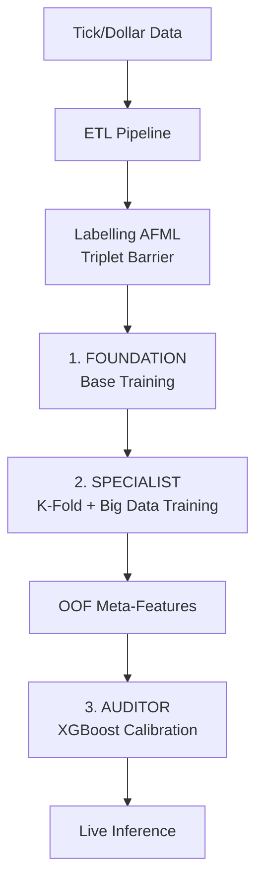

# TCN+LSTM Ensemble Architecture

> **Version:** 1.0 | **Repo:** [`QuantGod_Cloud_TCNLSTM`](https://github.com/atilioebg/QuantGod_Cloud_TCNLSTM) | **Branch:** `main` | **Status:** 🟢 Implementation Ready
>
> *Pivot from ViViT (Transformer) to Hybrid TCN+LSTM (Base) + XGBoost (Auditor)*

---

## 1. Motivation

The ViViT model trained on `vivit_L2_cloud` collapsed to **F1 Macro ≈ 0.29** — effectively predicting only the Neutral class (77% base rate). The root causes were:

- Quadratic attention over 720 steps requires very large `d_model`, making the model over-parameterized for 9 tabular features.
- The Transformer's global attention mechanism lacks the inductive bias for **local temporal patterns** present in financial microstructure data.
- No calibration stage — the single model output was used directly without a second-stage auditor.

The ensemble design corrects all three issues.

---



---

## 3. Base Model: `Hybrid_TCN_LSTM`

**File:** `src/cloud/base_model/models/model.py`

### 3.1 Architecture

| Layer | Details |
|:---|:---|
| Input | `(B, 720, 9)` — 12h lookback, 9 features |
| TCN Stack | 4 TCNBlock (dilations `[1,2,4,8]`, kernel=3) |
| TCN Channels | 64 (configurable via Optuna) |
| Residual | 1×1 conv when channels change, skip otherwise |
| LSTM | `hidden=256`, `layers=2`, `batch_first=True`, `dropout=0.2` |
| LSTM output | Last hidden state `h_n[-1]`: shape `(B, 256)` |
| Head | `Linear(256,128)` → `GELU` → `Dropout(0.4)` → `Linear(128,3)` |
| Output | `dict{"logits": (B,3), "probs": softmax(B,3)}` |

### 3.2 CausalConv1D Design

Zero future leakage is enforced by left-padding only:
```
padding = dilation × (kernel_size − 1)
```
The output's right side (size = padding) is trimmed after convolution. This ensures `output[t]` depends only on `input[t-k]` for `k ≥ 0`.

### 3.4 Big Data Optimization Engine
Para suportar **345M de amostras** em 20GB de VRAM:
- **QuantGodLazyDataset**: Mapeamento de memória de Parquets. Sem carregamento de RAM.
- **AMP (Automatic Mixed Precision)**: Treino em FP16 via `torch.cuda.amp`.
- **Gradient Accumulation**: Divisão do batch real em sub-batches para estabilidade gradiente.
- **Epoch-Chunking**: Treino por fatias representativas (ex: 10M amostras/época).
- **Subsampling Probabilístico**: Redução aleatória da densidade da classe Neutra (Classe 1).

### 3.3 Why TCN + LSTM (not pure Transformer)

| Dimension | Transformer (ViViT) | TCN+LSTM |
|:---|:---|:---|
| Complexity | O(T²) attention | O(T) causal conv + O(T) LSTM |
| Local patterns | Weak (global attention) | Strong (dilated local window) |
| Long-range memory | Via positional embedding | Via LSTM hidden state |
| Training stability | Sensitive to d_model/nhead | Stable with LSTM grad clip |
| Collapse risk | High (softmax saturation) | Lower (residual connections) |

---

## 4. Training Pipeline

**Files:**
- `src/cloud/base_model/treino/run_training.py`
- `src/cloud/base_model/treino/training_config.yaml`
- `src/cloud/base_model/configs/base_model_config.yaml`

### 4.1 Centralized Config

All shared constants live in **`base_model_config.yaml`** — the single source of truth:
```yaml
training:
  foundation_weights:
    use_auto_class_weights: true       # Dynamic balanced weights
  specialization_weights:
    use_auto_class_weights: true
  seq_len: 720                         # 12h lookback (1min bars) or 3h (5min bars)
  gradient_clip_norm: 1.0              # LSTM stability
```
Both `run_training.py` and `run_optuna.py` load from this file. **Nunca utilize pesos fixos estáticos**; o sistema agora calcula `auto_class_weights` baseados na distribuição real do Big Data para garantir o equilíbrio do Sniper Score.

### 4.2 Key Design Decisions

| Decision | Rationale |
|:---|:---|
| `FocalLossWithSmoothing` (dynamic alpha) | Auto-computes inverse frequency weights and penalizes easy NEUTRAL classifications |
| `AdamW(weight_decay=0.01)` | Proper L2 regularization for sequence models |
| `CosineAnnealingLR` | Smooth LR decay; avoids sharp steps that destabilize LSTM |
| `clip_grad_norm=1.0` | Prevents exploding gradients in LSTM backprop through time |
| `StandardScaler` (fit on train only) | Prevents leakage; Z-score optimal for TCN (scale-sensitive) |
| `EarlyStopping(patience=3)` | Uses `F1 Macro` (not loss) as stopping criterion |

---

## 5. Hyperparameter Optimization (Optuna)

**Files:**
- `src/cloud/base_model/otimizacao/run_optuna.py`
- `src/cloud/base_model/otimizacao/optimization_config.yaml`

### 5.1 Search Space

```yaml
tcn_channels: [32, 64, 128]
lstm_hidden:  [128, 256, 512]
num_lstm_layers: [1, 2]
lr: [5e-5, 1e-3]
dropout: [0.2, 0.5]
batch_size: [128, 256]    # 512 excluded: OOM risk
seq_len: [720, 1440]
```

### 5.2 OOM Guard (Constraint #4)

Every trial is wrapped:
```python
except RuntimeError as e:
    if "out of memory" in str(e).lower():
        torch.cuda.empty_cache()
        raise optuna.exceptions.TrialPruned()
```
`MedianPruner(n_startup_trials=5, n_warmup_steps=2)` prunes underperforming trials early.

---

## 6. Auditor Model: XGBoost

### 6.1 Walk-Forward OOF Training (Constraint #3)

**Zero data leakage guarantee:**

```
Dataset (chronological):
[═══ 90% DEV ═══════════════════════════════][═10% TEST═]

DEV split into K=5 folds via TimeSeriesSplit:
Fold 1: [TRAIN] → predict Fold 2 → OOF₂
Fold 2: [TRAIN + OOF₂ base] → predict Fold 3 → OOF₃
...
Fold K-1: [TRAIN] → predict Fold K → OOF_K

XGBoost trains on: [OOF₂ || OOF₃ || ... || OOF_K]
XGBoost evaluates on: [TEST (10%, never touched)]
```

**Rule:** XGBoost is NEVER trained on predictions generated from data that the TCN+LSTM used in backpropagation. Only Out-of-Fold predictions qualify.

### 6.2 Meta-Features (14 total)

| # | Feature | Source |
|:---|:---|:---|
| 0–2 | `prob_sell, prob_neutral, prob_buy` | TCN+LSTM output |
| 3 | `entropy` = -Σ p·log(p) | Uncertainty measure |
| 4–10 | `body, upper_wick, lower_wick, log_ret_close, volatility, mean_obi, mean_deep_obi` | Last timestep (t=720) |
| 11 | `rsi_14` | Computed from micro_price tensor |
| 12 | `ema_9_dist` | % distance from EMA9 |
| 13 | `ema_50_dist` | % distance from EMA50 |

**Excluded:** `max_spread` (≥0.8 corr. with `volatility`), `log_volume` (low signal post-probs), `MACD` (multicollinear with EMAs per Constraint #2).

### 6.3 No Warm-Up in Live Inference (Constraint #2)

All indicators (RSI, EMA distances) are extracted **from the 720-step micro_price tensor already in memory** — no waiting for warm-up periods:
```python
# Reconstruct relative micro_price from log_ret_close (col index 3)
log_rets = X_sequences[:, :, 3]            # (B, 720)
micro_prices = np.exp(np.cumsum(log_rets, axis=1))  # (B, 720)
rsi_14 = _rsi(micro_prices[j], period=14)  # Uses full 720-step history
```

---

## 7. Binance Live Adapter

**File:** `src/cloud/auditor_model/binance_adapter.py`

Port of `QuantGod/vivit_L2/src/live/collector_l2.py` (Bybit) adapted to Binance Futures.

### 7.1 Bybit vs Binance Protocol Differences

| Aspect | Bybit (Training) | Binance (Live) |
|:---|:---|:---|
| WebSocket URL | `settings.BYBIT_WS_URL` | `wss://fstream.binance.com/stream?streams=btcusdt@depth@100ms` |
| Subscribe | `{"op":"subscribe","args":["orderbook.50.BTCUSDT"]}` | Auto-subscribed by stream URL |
| Initial snapshot | `"type":"snapshot"` in WS | REST GET `/fapi/v1/depth?limit=1000` |
| Timestamp field | `ts` | `T` |
| Update IDs | Not tracked | `U` (first), `u` (final) — **used for sync** |
| Size = "0" | Delete entry | Delete entry ✅ Same |

### 7.2 Strict Sync Protocol (Constraint #1)

```
1. Open WebSocket connection
2. Buffer incoming delta messages (do NOT apply yet)
3. Fetch REST snapshot → get lastUpdateId, populate book
4. Drain buffer:
   - Discard if u <= lastUpdateId          (already in REST)
   - Discard if U > lastUpdateId + 1       (gap → re-bootstrap)
   - Apply if U <= lastUpdateId+1 <= u     (valid continuity)
5. Continue applying live deltas normally
```

### 7.3 Feature Parity

The math functions `_calculate_instant_features()` and `_finalize_minute()` are **line-for-line identical** to `L2LiveCollector.calculate_instant_features()` and `L2LiveCollector.finalize_minute()`. This guarantees that the 9 features produced live by Binance match the 9 features the model was trained on from Bybit.

### 7.4 Feature Drift Detection

On every candle, each feature is checked against the training Z-score distribution:
```
z = |feature_value − scaler_mean| / scaler_std
if any z > 4.0: log WARNING
```

---

## 8. Directory Structure

```
src/cloud/
├── base_model/
│   ├── configs/
│   │   └── base_model_config.yaml   ← SINGLE SOURCE OF TRUTH for class_weights, features
│   ├── labelling/
│   │   ├── run_labelling.py
│   │   └── labelling_config.yaml
│   ├── models/
│   │   └── model.py                 ← Hybrid_TCN_LSTM
│   ├── otimizacao/
│   │   ├── run_optuna.py
│   │   └── optimization_config.yaml
│   ├── pre_processamento/
│   │   └── etl/ (extract, transform, load, validate)
│   └── treino/
│       ├── run_training.py
│       └── training_config.yaml
└── auditor_model/
    ├── configs/
    │   └── auditor_config.yaml
    ├── feature_engineering_meta.py  ← 14 meta-features, zero warm-up
    ├── train_xgboost.py             ← OOF Walk-Forward K=5
    └── binance_adapter.py           ← Binance WS + REST sync
```

---

## 9. Execution Order

```powershell
# 1. ETL (on RunPod with data mounted)
python -m src.cloud.base_model.pre_processamento.orchestration.run_pipeline

# 2. Labelling
python -m src.cloud.base_model.labelling.run_labelling

# 3. Hyperparameter Optimization
python -m src.cloud.base_model.otimizacao.run_optuna

# 4. Final base model training (with best Optuna params)
python -m src.cloud.base_model.treino.run_training

# 5. XGBoost auditor training (walk-forward OOF)
python -m src.cloud.auditor_model.train_xgboost

# 6. Live inference (Binance)
python src/cloud/auditor_model/binance_adapter.py

# Testing (verify 2 candles)
python src/cloud/auditor_model/binance_adapter.py --test-mode --max-candles 2
```

---

## 10. Validation Checklist

```powershell
# Model import
python -c "from src.cloud.base_model.models.model import Hybrid_TCN_LSTM; print('OK')"

# Model shape test
python -c "
import torch
from src.cloud.base_model.models.model import Hybrid_TCN_LSTM
m = Hybrid_TCN_LSTM(num_features=9, seq_len=720)
out = m(torch.randn(4, 720, 9))
assert out['logits'].shape == (4, 3)
assert abs(out['probs'].sum(-1).mean().item() - 1.0) < 1e-5
print('Shape test PASS')
"

# ETL tests
pytest tests/test_cloud_etl_output.py -v
pytest tests/test_labelling_output.py -v
```

---

## 11. Key Constraints Summary

| # | Constraint | Implementation |
|:---|:---|:---|
| 1 | Binance WS sync | `lastUpdateId/U/u` discard logic + gap detection + re-bootstrap |
| 2 | No warm-up indicators | RSI/EMA extracted from 720-step tensor via cumulative exp of log_ret_close |
| 3 | OOF walk-forward | `TimeSeriesSplit(n_splits=5)` + OOF predictions only for XGBoost training |
| 4 | OOM guard | `RuntimeError` catch → `empty_cache()` → `TrialPruned()` in every trial |
