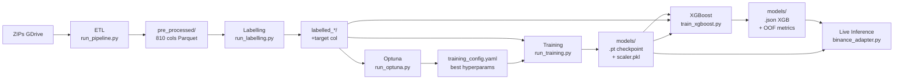

# 🚁 7. Operational Manual — Pipeline de Execução

> **Target Audience**: MLOps, Operadores de Trading.
> Este manual documenta como executar o pipeline completo do QuantGod Cloud em produção (RunPod) e localmente para desenvolvimento.

---

## 📋 Pré-Requisitos

Antes de qualquer execução:
1. ✅ Ambiente Python configurado ([`1_SETUP_AND_ENV.md`](1_SETUP_AND_ENV.md))
2. ✅ rclone montado e acessando os ZIPs do GDrive
3. ✅ PYTHONPATH apontando para a raiz do projeto
4. ✅ Configs YAML válidas: `pytest tests/test_config_integrity.py -v`

---

## 🗺️ Mapa do Pipeline



---

## 🚀 Execução Passo a Passo

### Passo 1 — ETL

```bash
python -m src.cloud.base_model.pre_processamento.orchestration.run_pipeline
```

- **Input:** ZIPs do GDrive (via rclone mount)
- **Output:** `data/L2/pre_processed/YYYY-MM-DD_*.parquet` (810 colunas, ~1440 linhas/arquivo)
- **Duração:** ~2–4 horas para o dataset completo (2023–2026) em 8 vCPUs

**Validar:**
```bash
pytest tests/test_cloud_etl_output.py tests/test_preprocessed_quality.py -v
```

---

### Passo 2 — Labelling

```bash
python -m src.cloud.base_model.labelling.run_labelling
```

- **Input:** `data/L2/pre_processed/`
- **Output:** `data/L2/labelled_*/` definido em `labelling_config.yaml` (`output_dir`)
- **Config:** `src/cloud/base_model/labelling/labelling_config.yaml`
- **Duração:** ~30 minutos (paralelo com 6 workers)

**Validar:**
```bash
pytest tests/test_labelling_output.py -v
```

---

### Passo 3 — Hyperparameter Optimization (Optuna)

```bash
python -m src.cloud.base_model.otimizacao.run_optuna
```

- **Input:** Dataset labelled (`labelled_dir` em `optimization_config.yaml`)
- **Output:** `data/models/optuna_study.db` (SQLite) — melhores HPs logados
- **Config:** `src/cloud/base_model/otimizacao/optimization_config.yaml`
- **Duração:** ~6–12 horas (50 trials, RTX 4090)
- **Metric:** F1 Macro (evita dominância da classe NEUTRAL)

> Se um trial causar OOM, é automaticamente prunado com `torch.cuda.empty_cache()`.

---

### Passo 4 — Treino do Base Model

```bash
python -m src.cloud.base_model.treino.run_training
```

- **Input:** Dataset labelled, best HPs do Optuna (em `training_config.yaml`)
- **Output:** `data/models/base_model.pt` + `data/models/scaler_finetuning.pkl`
- **Config:** `src/cloud/base_model/treino/training_config.yaml`
- **Duração:** ~3–6 horas (10–20 épocas, EarlyStopping patience=3)

**Métricas monitoradas:**
- Train Loss, Val Loss
- F1 Macro (critério de early stopping)

---

### Passo 5 — Treino do Auditor XGBoost

```bash
python -m src.cloud.auditor_model.train_xgboost
```

- **Input:** Dataset labelled + checkpoint do base model
- **Output:** `data/models/xgb_auditor.json` + métricas OOF/test
- **Config:** `src/cloud/auditor_model/configs/auditor_config.yaml`
- **Duração:** ~30–60 minutos (5 folds OOF)

**Protocolo:** Gera predições Out-of-Fold do base model (sem leakage) e treina XGBoost sobre 14 meta-features.

---

### Passo 6 — Live Inference (Binance Futures)

```bash
# Produção
python src/cloud/auditor_model/binance_adapter.py

# Modo de teste (2 candles completos)
python src/cloud/auditor_model/binance_adapter.py --test-mode --max-candles 2
```

- **Requer:** `base_model.pt`, `scaler_finetuning.pkl`, `xgb_auditor.json`
- **Conexão:** Binance Futures WebSocket + REST (sem API key para leitura pública)
- **Frequência:** 1 predição/minuto

**Saída por candle:**
```
[2026-02-20 15:30:00] Signal: BUY | Confidence: 0.821 | Base: BUY(0.743) | Entropy: 0.312
  Features — Z-score drift check: all OK
```

---

## 🖥️ Guia Completo RunPod (Pod Fresh)

```bash
# 1. Clonar e configurar
git clone https://github.com/atilioebg/QuantGod_Cloud_TCNLSTM.git /workspace
cd /workspace
python -m venv venv && source venv/bin/activate
pip3 install torch torchvision torchaudio --index-url https://download.pytorch.org/whl/cu121
pip install -r requirements.txt
export PYTHONPATH=/workspace

# 2. rclone
mkdir -p /root/.config/rclone/
cp rclone.conf /root/.config/rclone/rclone.conf
mkdir -p /workspace/gdrive
rclone mount drive: /workspace/gdrive --vfs-cache-mode full --allow-other &

# 3. Ajustar cloud_config.yaml
#    rclone_mount: "/workspace/gdrive/PROJETOS/BTC_USDT_L2_2023_2026"

# 4. Testes básicos (sem dados)
pytest tests/test_config_integrity.py tests/test_meta_features.py tests/test_model.py -v

# 5. Pipeline completo
#    (em sessões tmux separadas para não perder progresso)
tmux new -s etl       # python -m src.cloud.base_model.pre_processamento.orchestration.run_pipeline
tmux new -s label     # python -m src.cloud.base_model.labelling.run_labelling
tmux new -s optuna    # python -m src.cloud.base_model.otimizacao.run_optuna
tmux new -s train     # python -m src.cloud.base_model.treino.run_training
tmux new -s xgb       # python -m src.cloud.auditor_model.train_xgboost
tmux new -s live      # python src/cloud/auditor_model/binance_adapter.py
```

---

## 🔧 Troubleshooting

| Problema | Causa | Solução |
|:---|:---|:---|
| `ModuleNotFoundError: src` | PYTHONPATH não configurado | `export PYTHONPATH=/workspace` |
| `CUDA out of memory` | batch_size ou seq_len muito alto | Optuna aplica OOM guard automaticamente; reduza `batch_size` em `training_config.yaml` |
| `No ZIP files found` | rclone não montado ou path errado | `rclone lsd drive:` e verifique `cloud_config.yaml` → `rclone_mount` |
| `Dataset vazio no labelling` | `labelling_config.yaml` → `input_dir` incorreto | Verificar que `pre_processed/` tem arquivos `.parquet` |
| `XGBoost: base model checkpoint not found` | `auditor_config.yaml` → `base_model_checkpoint` incorreto | Verificar que `run_training.py` salvou o `.pt` corretamente |
| `test_config_integrity FAIL: labelled_dir mismatch` | `training_config.yaml` e `auditor_config.yaml` com dirs diferentes | Sincronizar `labelled_dir` nos dois arquivos |

---

## 📊 Monitoramento de Logs

Logs são salvos automaticamente em `logs/`:

| Log | Localização | Atualização |
|:---|:---|:---|
| ETL progress | `logs/etl/etl_YYYYMMDD.log` | A cada arquivo processado |
| Labelling | `logs/labelling/labelling_YYYYMMDD.log` | A cada arquivo labelled |
| Optuna trial | `logs/optimization/optuna_<study>_<timestamp>.log` | A cada trial |
| Training epoch | `logs/training/train_YYYYMMDD.log` | A cada época |
| Debug plots | `logs/debug_plots/` | Por demanda manual |

Consulte `logs/LOGS_README.md` para detalhes completos de convenções e retenção.
