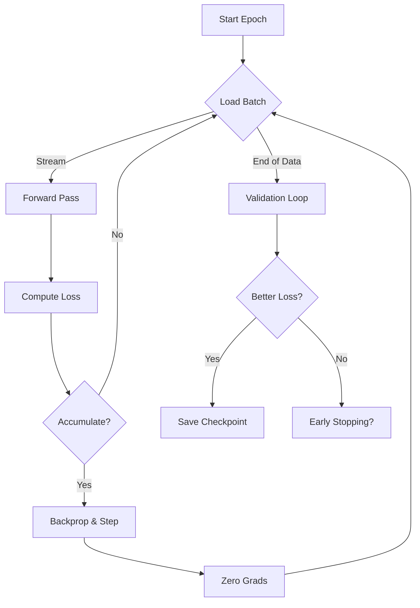

# 🏋️ 6. Training Lifecycle (MLOps)

> **Target Audience**: MLOps Engineers.

The training pipeline allows for training large models on consumer hardware (e.g., RTX 3060) using **Gradient Accumulation** and **Mixed Precision**.

---

## 🔄 The Loop (`train.py`)
### Key Technologies
1.  **Virtual Batch Size**:
    - **Physical Batch**: `3` (What fits in VRAM).
    - **Accumulation Steps**: `5` (Gradients are summed over 5 steps).
    - **Effective Batch**: `15`.
    - *Code*: `loss = loss / ACCUMULATION_STEPS` -> `loss.backward()` -> `optimizer.step()` every 5th iter.

2.  **Mixed Precision (AMP)**:
    - Uses `float16` for matrix multiplications and `float32` for stability.
    - Controlled by `torch.cuda.amp.GradScaler`.

3.  **Streaming Data Loading**:
    - Uses `IterableDataset` to stream data from disk (Parquet) instead of loading everything into RAM.
    - Zero data leakage via strictly chronological split.

### 🔄 The Cycle


---

## 📉 Optimization Config
- **Loss Function**: `CrossEntropyLoss`.
    - **Class Weights**: `[1.0, 10.0, 10.0, 20.0]` (Neutro, Stop, Long, SuperLong). Heavily penalizes missing a Super Long.
- **Optimizer**: `AdamW` (Adaptive Moment Estimation with Weight Decay).
    - `lr=1e-4`, `weight_decay=1e-5`.
- **Scheduler**: Early Stopping based on Validation Loss (Patience = 3 Epochs).

---

## 💾 Checkpoints
- **Best Model**: Saved to `data/saimp_best.pth`.
    - Only overwritten if Validation Loss improves.
- **Logs**: Saved to `logs/train_run_{YYYYMMDD_HHMMSS}.txt`.
    - Captures all stdout/stderr.
- **Graphs**: `logs/train_run_...png`.
    - Plots Loss and Accuracy curves automatically.

---

## 📊 Monitoring
Watch the usage logs:
```text
[EPOCH] Epoch 1/15
   Batch    0 | Loss: 1.3800 | Acc: 33.33%
   [RAM] 12.5 GB / 32.0 GB
```
If VRAM hits 100%, reduce `BATCH_SIZE` in `src/config.py` immediately.
