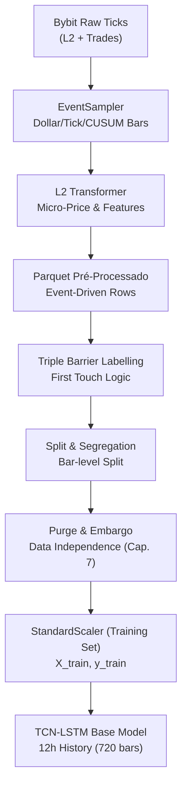

# 📊 QuantGod — Referência Técnica de Dados
**Documento de referência para engenheiros de dados e desenvolvedores construindo sistemas que consomem os mesmos inputs que o modelo QuantGod.**

---

## 1. Fonte dos Dados Brutos (Raw L2)

### 1.1 Origem
- **Exchange**: Bybit (BTC/USDT Perpetual Futures)
- **L2 Data**: **Bybit Order Book Contract** (Profundidade Completa)
- **Trade Data**: **Bybit Public Trading History Contract** (Tick-by-tick trades)
- **Formato L2**: Arquivos ZIP mensais contendo JSON/data (`drive:PROJETOS/BTC_USDT_L2_2023_2026`)
- **Formato Trades**: Arquivos CSV diários/mensais

### 1.2 Estrutura de Cada Mensagem JSON Bruta
Cada arquivo dentro do ZIP contém uma sequência de mensagens JSON, de dois tipos:

#### Tipo `snapshot` (Mensagem de Estado Inicial)
```json
{
  "type": "snapshot",
  "ts": 1704067200000,
  "data": {
    "b": [["43100.5", "1.234"], ["43100.0", "0.890"], ...],
    "a": [["43101.0", "2.100"], ["43101.5", "0.456"], ...]
  }
}
```

#### Tipo `delta` (Mensagem de Atualização Incremental)
```json
{
  "type": "delta",
  "ts": 1704067200150,
  "data": {
    "b": [["43100.5", "0.000"], ["43099.0", "5.000"]],
    "a": [["43102.0", "1.500"]]
  }
}
```

| Campo | Tipo | Descrição |
|:---|:---|:---|
| `type` | string | `"snapshot"` (estado completo inicial) ou `"delta"` (atualização incremental) |
| `ts` | int (ms) | Timestamp Unix em **milissegundos** |
| `data.b` | list of [string, string] | Lista de níveis de Bid: `[preço, quantidade]` |
| `data.a` | list of [string, string] | Lista de níveis de Ask: `[preço, quantidade]` |

> [!IMPORTANT]
> Um tamanho (`quantidade`) igual a `"0.000"` em uma mensagem `delta` significa **remoção** do nível de preço, não um nível com tamanho zero.

---

## 1.3 Dados de Execução (Trades)

### Origem: Bybit Public Trading History Contract
Os dados de trades são essenciais para a geração de **Dollar Bars** e cálculo de **VWAP**.

| Coluna | Descrição |
|:---|:---|
| `timestamp` | Unix Timestamp (Segundos com precisão decimal) |
| `symbol` | Par de negociação (ex: BTCUSDT) |
| `side` | Direção do agressor (Buy/Sell) |
| `size` | Quantidade executada (BTC) |
| `price` | Preço de execução |
| `tickDirection` | Direção do tick (PlusTick, MinusTick, ZeroPlusTick, ZeroMinusTick) |
| `trdMatchID` | ID único da execução |
| `grossValue` | Valor bruto da transação em USDT (Price * Size) |

> [!NOTE]
> O pipeline de amostragem avançada utiliza a coluna `ts` (convertida de `timestamp` para ms) para alinhar trades com o estado do Order Book.

---

## 2. OB200 vs OB500 — Profundidade do Orderbook

### 2.1 Contexto Histórico
Os dados brutos Bybit passaram por mudança de profundidade ao longo dos anos:

| Período | Profundidade Original |
|:---|:---|
| 2023 | OB500 (500 níveis de bid + 500 de ask) |
| 2024–2026 | OB200 (200 níveis de bid + 200 de ask) |

### 2.2 Hard Cut 200 (Normalização)
O pipeline aplica um **Hard Cut** automático para **exatamente 200 níveis** em ambos os lados. Isso garante:
- Que arquivos OB500 (2023) e OB200 (2024+) produzam **estrutura de colunas idêntica** no output.
- Que o modelo receba sempre a **mesma dimensionalidade**, independente do período dos dados.
- Os top 200 bids (preços decrescentes) e top 200 asks (preços crescentes) são mantidos.

> [!NOTE]
> **Por que 200?** O nível 200 captura liquidez suficiente para análise de pressão de mercado sem o ruído de níveis extremamente profundos. Níveis abaixo de 200 têm impacto marginal ínfimo na dinâmica de curto prazo analisada pelo modelo.

**Lógica de captura (código fonte `transform.py`):**
```python
sorted_bids = sorted(self.bids_book.keys(), reverse=True)[:200]  # Top 200 bids, ordem decrescente
sorted_asks = sorted(self.asks_book.keys())[:200]                 # Top 200 asks, ordem crescente
```

---

## 3. Timeframe dos Dados e Processo de Amostragem

### 3.1 Frequência Bruta (Ticks)
- As mensagens WebSocket chegam como **ticks em tempo real**, com granularidade de **milissegundos** (o campo `ts` é Unix em ms).
- A frequência real varia com a atividade do mercado (pode ser várias mensagens por segundo).

### 3.2 Amostragem Temporal — 1 segundo
O `L2Transformer` aplica **sampling temporal de 1000ms**:

```python
self.sampling_ms = 1000  # Configurado em cloud_config.yaml → etl.sampling_interval_ms
```

**Lógica:**
- O orderbook interno é mantido em memória e atualizado a cada tick.
- A cada vez que `ts - last_sample_ts >= 1000ms`, uma **fotografia (snapshot)** do estado atual do orderbook é capturada.
- O timestamp de captura é **alinhado à janela**: `(ts // 1000) * 1000`.
- Isso produz **aprox. 1 linha por segundo** por arquivo ZIP.

### 3.3 Amostragem Avançada (AFML Event-Driven)
O `EventSampler` abandona o resampling cronológico fixo em favor de barras IID baseadas em atividade:

| Tipo de Barra | Gatilho (Trigger) | Objetivo |
|:---|:---|:---|
| **Dollar Bars** | Acúmulo de $N (ex: 100k USD) | Estabilidade da variância do retorno |
| **Tick Bars** | Acúmulo de $N$ trades (ex: 1000) | Sincronia com a velocidade do mercado |
| **Information Bars** | Fluxo de OFI (Order Flow Imbalance) | Capturar micro-momentos de assimetria |
| **CUSUM Bars** | Desvio direcional adaptativo ($h$) | Filtragem de ruído lateral |

**Lógica de Reconciliação (Overflow):**
- Se um trade de 150k USD ocorre e o limite da Dollar Bar é 100k, a barra fecha com 100k e os 50k excedentes são levados para a abertura da próxima barra. Isso garante a **Conservação de Massa** total dos dados.

> [!IMPORTANT]
> **O timeframe agora é dinâmico.** Cada linha no Parquet representa uma "unidade de informação" (barra de evento), não necessariamente 1 minuto de relógio. Em momentos de alta volatilidade, podemos ter 10 barras por minuto; em mercados lentos, 1 barra a cada 5 minutos (heartbeat).

---

## 4. Colunas dos Dados Pré-Processados (Output do ETL)

Os arquivos Parquet produzidos pelo ETL (`data/L2/pre_processed/*.parquet`) possuem **810 colunas** no total.

### 4.1 Tabela de Colunas
| Grupo | Padrão de Nome | Qtd | Descrição |
|:---|:---|:---|:---|
| **Orderbook Bids** | `bid_{i}_p` | 200 | Preço do i-ésimo nível de Bid (i=0 é o best bid) |
| **Orderbook Bids** | `bid_{i}_s` | 200 | Quantidade (size) do i-ésimo nível de Bid |
| **Orderbook Asks** | `ask_{i}_p` | 200 | Preço do i-ésimo nível de Ask (i=0 é o best ask) |
| **Orderbook Asks** | `ask_{i}_s` | 200 | Quantidade (size) do i-ésimo nível de Ask |
| **Features Derivadas** | *(ver seção 5)* | 32 | Features de treinamento calculadas no resampling |
| **Referência de Preço** | `close` | 1 | Micro-price de fechamento do candle de 1min |
| **TOTAL** | | **833** | |

**Exemplo de nomes de colunas de orderbook:**
```
bid_0_p, bid_0_s, bid_1_p, bid_1_s, ..., bid_199_p, bid_199_s
ask_0_p, ask_0_s, ask_1_p, ask_1_s, ..., ask_199_p, ask_199_s
```

### 4.2 Index do Parquet
O índice do DataFrame (e do arquivo Parquet) é `datetime` — timestamps em UTC com frequência de 1 minuto.

---

## 5. Features Derivadas — Cálculo Detalhado

As 32 features derivadas são as **colunas usadas como input direto pelo modelo de treinamento**. Elas são calculadas sobre os dados já reamostrados em 1 minuto.

### 5.1 Features de Candle (Forma/Estrutura)

#### `body` — Retorno Logarítmico do Corpo da Vela
```python
body = np.log(close / open)  # log(fechamento / abertura)
```
- Captura o **movimento líquido** dentro do candle (positivo = candle de alta, negativo = queda).
- Usa logaritmo para garantir simetria e estacionariedade.

#### `upper_wick` — Sombra Superior Normalizada
```python
upper_wick = (high - max(open, close)) / prev_close
```
- Normalizado pelo fechamento do candle **anterior** para manter escala consistente ao longo do tempo.
- Representa a **rejeição de preço** na parte superior da vela.

#### `lower_wick` — Sombra Inferior Normalizada
```python
lower_wick = (min(open, close) - low) / prev_close
```
- Normalizado pelo fechamento do candle anterior.
- Representa a **rejeição de preço** na parte inferior da vela.

### 5.2 Features de Retorno

#### `log_ret_close` — Log-Retorno do Fechamento
```python
log_ret_close = np.log(close / prev_close)
```
- Retorno logarítmico entre o fechamento atual e o fechamento do candle anterior.
- Produz série **estacionária** (apta para modelos de ML sem diferenciação adicional).

### 5.3 Features de Microestrutura do Orderbook

#### `volatility` — Volatilidade Intra-Candle
```python
volatility = std(micro_price)  # desvio padrão da micro_price nos segundos dentro do minuto
```
- Calculado como o **desvio padrão dos ticks de 1s** que compõem cada candle de 1min.
- Captura turbulência de preço dentro de cada minuto.

#### `max_spread` — Spread Máximo no Candle
```python
max_spread = max(spread)  # spread máximo dos ticks de 1s no minuto
```
Onde:
```python
spread = ask_0_p - bid_0_p  # calculado por tick durante o sampling de 1s
```
- Captura **momentos de stress de liquidez** no minuto.

#### `mean_obi` — Order Book Imbalance (Top 1 Nível)
```python
mean_obi = mean(obi_l0)   # média dos OBIs de 1s no minuto
```
Onde:
```python
obi_l0 = (bid_0_s - ask_0_s) / (bid_0_s + ask_0_s)
```
- Range: `[-1, +1]`. Positivo = pressão compradora no topo do book.
- OBI calculado por tick e depois **médio** por minuto.

#### `mean_deep_obi` — Order Book Imbalance Profundo (Top 5 Níveis)
```python
mean_deep_obi = mean(deep_obi_5)  # média dos deep OBIs de 1s no minuto
```
Onde:
```python
bid_vol_5 = sum(bid_0_s ... bid_4_s)
ask_vol_5 = sum(ask_0_s ... ask_4_s)
deep_obi_5 = (bid_vol_5 - ask_vol_5) / (bid_vol_5 + ask_vol_5)
```
- Similar ao `mean_obi` mas usa os **5 melhores níveis** de cada lado, capturando liquidez mais representativa.

#### `log_volume` — Volume Logarítmico (Proxy de Atividade)
```python
log_volume = np.log1p(tick_count)
```
Onde `tick_count` é o **número de mensagens L2 recebidas** no minuto (snapshot + deltas).
- Usado como proxy de volume e atividade de mercado (dados L2 não contêm trade volume diretamente).

### 5.4 Multi-Scale Features (📡 Sniper Triggers)

#### `ofi_delta_1` / `ofi_delta_5` — Aceleração da Agressão
- **Delta 1min**: Captura o choque instantâneo de fluxo.
- **Delta 5min**: Captura a tendência estrutural de agressão.
- A TCN usa ambos para distinguir entre spikes isolados e rompimentos reais.

#### `bid_rdi_delta_1` / `ask_rdi_delta_1` — Choque de Profundidade
- Captura a remoção/adição instantânea de liquidez. Essencial para identificar o início de uma absorção ou bleed de liquidez.

#### `micro_price_delta_1` / `micro_price_delta_5` — Momentum do Preço Real
- **Delta 1min**: Gatilho rápido de desequilíbrio de preço.
- **Delta 5min**: Drift de valor justo institucional.

---

### 5.6 Deep-Book Intelligence (🧬 Phase 6 Orthogonal)

#### `kyle_lambda` — Kyle's Lambda (Absorção)
```python
lambda = micro_price_delta_1 / (abs(ofi_delta_1) + 1e-9)
```
- Mede o **custo de liquidez**: quanto o preço se move para cada unidade de fluxo líquido. 
- Valores baixos indicam alta absorção (liquidez profunda absorvendo ordens). 
- Valores altos indicam "slippage" institucional ou falta de suporte.

#### `bid_deep_ratio` / `ask_deep_ratio` — Deep-to-Front Ratio (L200/L5)
```python
ratio = sum(vol_L50_L200) / sum(vol_L0_L5)
```
- Compara a "intenção profunda" institucional (níveis 50-200) com as "paredes de tela" (níveis 0-5).
- Detecta quando grandes players estão posicionando liquidez profunda antes de um movimento direcional.

#### `bid_convexity` / `ask_convexity` — Book Convexity (Gradient)
```python
convexity = sum(vol_L1_L10) / sum(vol_L11_L20)
```
- Analisa o **gradiente de proteção** imediata. Identifica se a liquidez está concentrada no topo ou se há um "vácuo" logo atrás dos primeiros níveis.

---

### 5.5 Advanced Institutional Microstructure (🏛️ Nível 4)

#### `micro_price_delta_5` — Momentum do Preço Real
```python
micro_price_delta_5 = (MP_atual / MP_5min_atras) - 1
```
- Micro-Price pende para o lado com menos liquidez no topo. Se ela se move rapidamente, o preço do mercado deve acompanhá-la em breve (Alpha de convergência).

#### `book_asymmetry_v5` — Detecção de Absorção (L5)
```python
book_asymmetry_v5 = log((sum_bids_L5 + epsilon) / (sum_asks_L5 + epsilon))
```
- Captura se há "paredes" ocultas nos 5 primeiros níveis. Valores positivos altos indicam forte suporte de volume que pode estar absorvendo vendas.

#### `spread_zscore_60` — Termômetro de Estresse
```python
spread_zscore_60 = (spread_atual - mean_spread_60) / (std_spread_60 + 1e-9)
```
- Identifica anomalias de spread (ex: falta abrupta de market makers). Essencial para o modelo saber quando o mercado está "esticado" ou ilíquido.

#### `vpin_lite_5` — Toxicidade de Fluxo (V-PIN)
```python
vpin_lite_5 = sum(abs(ofi), 5min) / (total_depth_L5 + epsilon)
```
- Mede o quão "tóxico" é o fluxo: se o OFI está girando muito capital em relação à liquidez disponível no book, indicando possível exaustão ou predação institucional.

---

## 6. Micro-Price — Variável Auxiliar (não é input direto)

A **micro-price** é um preço ponderado pelo tamanho dos top bids e asks:
```python
micro_price = (bid_0_p * ask_0_s + ask_0_p * bid_0_s) / (bid_0_s + ask_0_s)
```
- Representa o **preço justo de curtíssimo prazo**, ponderando a pressão de cada lado do book.
- Usada para gerar OHLC (open/high/low/close) durante o resampling de 1min.
- O timeframe efetivo de análise do modelo é 1 minuto. Cada linha no arquivo Parquet pré-processado representa 1 candle de 1 minuto do orderbook de BTC/USDT Perpetual Futures.
- `micro_price` **não é passada diretamente ao modelo** — apenas suas transformações derivadas (OHLC, Volatilidade, Momenta, etc).

---

## 7. Inputs Diretos do Modelo (QuantGodModel)

### 7.1 Feature Columns (32 colunas)
O modelo recebe **exclusivamente estas 32 colunas** como input:

```python
feature_cols = [
    # Core OHLC + OBI (9)
    'body', 'upper_wick', 'lower_wick', 'log_ret_close', 
    'volatility', 'max_spread', 'mean_obi', 'mean_deep_obi', 'log_volume',
    # Multi-Scale Triggers (12)
    'ofi', 'ofi_delta_5', 'ofi_delta_30',
    'micro_price_momentum', 'micro_price_delta_5', 'micro_price_delta_30',
    'bid_rdi', 'bid_rdi_delta_5', 'bid_rdi_delta_30',
    'ask_rdi', 'ask_rdi_delta_5', 'ask_rdi_delta_30',
    # Institutional & Deep-Book (9)
    'book_asymmetry_v5', 'spread_zscore_60', 'vpin_min25', 
    'kyle_lambda', 'bid_deep_ratio', 'ask_deep_ratio', 
    'bid_convexity', 'ask_convexity', 'pressure_ratio'
    # Note: book_skew_bid/ask are available in Parquet but NOT used directly by Base Model
]
```

### 7.2 Shape do Tensor de Input
```
Input Tensor Shape: (Batch, Seq_Len, 32)
```
Onde:
- **Batch**: tamanho do batch (configurável: 32..512)
- **Seq_Len**: **720** candles de 1 minuto = **12 horas** de histórico
- **32**: as 32 feature columns acima

### 7.3 Normalização dos Inputs
Antes de entrar no modelo, as 32 features são normalizadas com **StandardScaler** (Z-Score):
```python
scaler = StandardScaler()
scaler.fit(X_raw[:split_idx])  # Fit apenas no conjunto de treino (sem data leakage)
X_norm = scaler.transform(X_raw)
```
O scaler treinado é salvo em `data/models/scaler_finetuning.pkl`.

---

## 8. Rotulagem (Target Variable)

### 8.1 Labelling: Triple Barrier Method (AFML Cap. 3)
O target não é mais um retorno fixo ponto-a-ponto, mas sim o resultado da **interação do preço com 3 barreiras dinâmicas**:

1.  **Horizontal Superior (TP)**: $2.0 \times \sigma_{ewma}$. Se tocada primeiro $\rightarrow$ BUY (2).
2.  **Horizontal Inferior (SL)**: $1.0 \times \sigma_{ewma}$. Se tocada primeiro $\rightarrow$ SELL (0).
3.  **Vertical (Time-Stop)**: Janela de $N$ minutos. Se atingida sem toque nas horizontais $\rightarrow$ NEUTRAL (1).

**First Touch Rule:** No caso de alta volatilidade onde ambas as barreiras horizontais são atingidas na mesma janela, o label é definido pelo evento que ocorreu **temporalmente primeiro** (`use_first_touch: true`).

### 8.2 Parâmetros Dinâmicos (Master Config)
| Parâmetro | Descrição |
|:---|:---|
| `horizon_minutes` | Janela de lookahead (ex: 15min) |
| `pt_multiplier` | Coeficiente de Take Profit em relação à volatilidade |
| `sl_multiplier` | Coeficiente de Stop Loss (geralmente 1:2 ou 1:1) |
| `adaptive_h` | Se `true`, o filtro CUSUM adapta-se à volatilidade local |

---

## 9. Colunas das Features vs. Colunas Auxiliares

### Resumo Completo

| Coluna | Tipo | Usado como Input? | Usado para gerar input? | Como? |
|:---|:---|:---|:---|:---|
| `body` | Derivada | ✅ Sim (input direto) | — | `log(close / open)` |
| `upper_wick` | Derivada | ✅ Sim (input direto) | — | `(high - max(open,close)) / prev_close` |
| `lower_wick` | Derivada | ✅ Sim (input direto) | — | `(min(open,close) - low) / prev_close` |
| `log_ret_close` | Derivada | ✅ Sim (input direto) | ✅ Sim (gera target) | `log(close / prev_close)` |
| `volatility` | Derivada | ✅ Sim (input direto) | — | `std(micro_price)` por minuto |
| `max_spread` | Derivada | ✅ Sim (input direto) | — | `max(ask_0_p - bid_0_p)` por minuto |
| `mean_obi` | Derivada | ✅ Sim (input direto) | — | `mean((bid_0_s - ask_0_s) / (bid_0_s + ask_0_s))` |
| `mean_deep_obi` | Derivada | ✅ Sim (input direto) | — | `mean(deep_obi_5)` dos 5 melhores níveis |
| `log_volume` | Derivada | ✅ Sim (input direto) | — | `log1p(tick_count)` |
| `close` | Auxiliar | ❌ Não (input direto) | ✅ Sim (referência) | Micro-price de fechamento |
| `bid_{0..199}_p/s` | Orderbook Raw | ❌ Não (input direto) | ✅ Sim (gera features) | Estado do book no fechamento |
| `ask_{0..199}_p/s` | Orderbook Raw | ❌ Não (input direto) | ✅ Sim (gera features) | Estado do book no fechamento |
| `target` | Label | ❌ (y, não é X) | — | Thresholds sobre `future_return` |

---

## 10. Pipeline Completo — Resumo do Fluxo (AFML v9.5)



---

## 11. Informações para Reprodução em Segunda IA

Para uma segunda IA que deve receber os **mesmos dados como input**, as seguintes garantias devem ser satisfeitas:

1. **Mesma fonte de dados**: Bybit L2 Order Book, BTC/USDT Perpetual Futures.
2. **Amostragem por Eventos**: Deve utilizar **Dollar Bars** ou **Tick Bars** conforme o `sampling_mode` do config.
3. **Mesmo Hard Cut**: Top 200 bids (desc) e top 200 asks (asc).
4. **Mesmas 32 features**: calculadas sobre as barras de eventos, na mesma ordem (ver seção 7.1).
5. **Mesma normalização**: StandardScaler fit no conjunto de treino, aplicado em treino e validação.
6. **Mesmo `seq_len`**: 720 barras (o que pode representar tempo variável, mas 720 observações).
7. **Mesmo scaler**: Deve usar o `scaler_finetuning.pkl` salvo durante o treino do modelo original para garantir mesma distribuição em inferência.
