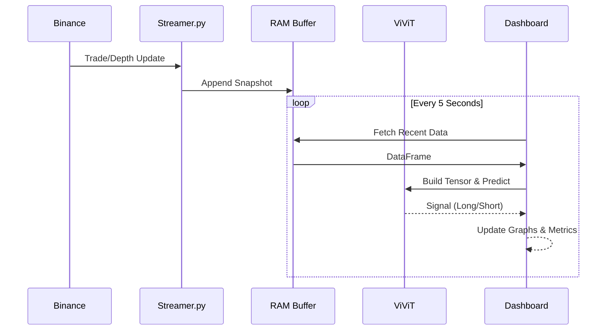

# 🚁 7. Operational Manual (Cockpit)

> **Target Audience**: Traders, Operators.

The **Sniper Cockpit** (`src/dashboard/app.py`) is the interface between the AI and the Human Pilot.

---

## 🖥️ The Dashboard
Run with:
```powershell
streamlit run src/dashboard/app.py
```

### 📡 Data Flow (Live)


### 1. Head-Up Display (Metrics)
- **Signal**: `NEUTRO` (Wait), `LONG` (Buy), `SHORT` (Sell).
- **Probabilidade IA**: Confidence level. **>60%** is "Sniper Mode".
- **Order Flow (OFI)**: The "Fuel".
    - `> 0`: Buying Pressure.
    - `< 0`: Selling Pressure.
    - *Correlation*: Confirm a LONG signal only if OFI is Positive.

### 2. The Chart (Visuals)
- **Price Candles**: Standard OHLC.
- **Zones of Test 🔴/🟢**: Solid thick lines. Where the battle is happening NOW.
- **Structure ----**: Dashed lines. Historical support/resistance.
- **Psychological -.-.**: Round numbers (e.g., $100k).

### 3. The Verdict (Narrative)
The system generates a natural language explanation:
> *"✅ Suporte confirmado! O fluxo agressivo valida a região de liquidez."*
This helps you understand **WHY** the AI allows the trade.

---

## 🔎 Audit Tools
### `verify_labels.py`
Checks if your Labeling Strategy yields a sane distribution.
```powershell
python -m src.visualization.verify_labels
```
Expect: `Top 1%` of trades to be `SUPER LONG`.

### `check_stream.py`
Verifies if WebSocket data is arriving and being saved to `data/raw/stream/`.
```powershell
python -m src.audit.check_stream
```
Use this if the dashboard OFI stays flat at 0.0.
