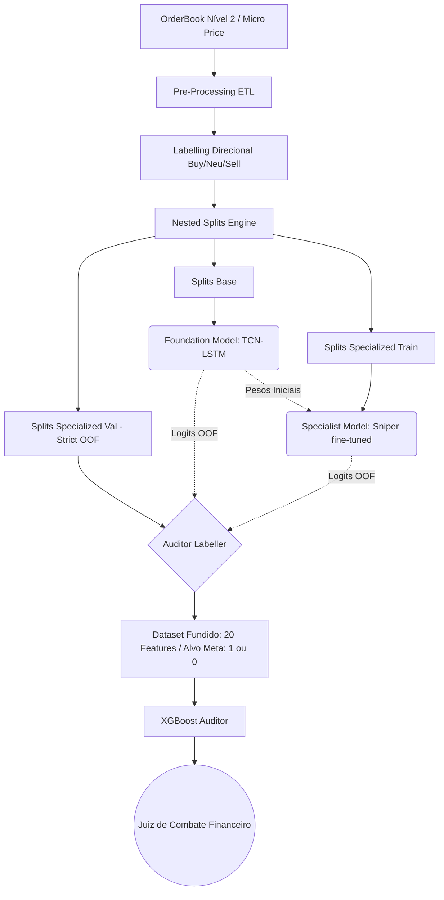

# Auditor Internal Logic (XGBoost Meta-Labeler)

## 1. O Conceito de Meta-Labeling

A arquitetura do **QuantGod** (v4.3) implementa uma cascata rigorosa de isolamento de dados (Strict Out-of-Fold) composta por três motores:
1. **Foundation (TCN+LSTM):** Treinado em `splits_base/train`, captura a inteligência global do mercado (F1 Macro).
2. **Specialist (TCN+LSTM):** Descendente direto da Base, treinado em `splits_specialized/train`, calibrado com pesos draconianos corporativos para focar estritamente nas pontas (Sniper Score: SELL/BUY).
3. **Auditor (XGBoost):** O Juiz final. Ele não prevê a direção do mercado (BUY/SELL), ele prevê se o *Especialista vai acertar ou errar*.

O **Meta Target** (`meta_target`) do Auditor é binário:
*   `1 (ACERTO)`: A predição do modelo Especialista foi igual ao alvo real do mercado.
*   `0 (ERRO)`: A predição do modelo Especialista divergiu do alvo real (Fakeout).

Para aprender esse padrão de erro, o Auditor é treinado única e exclusivamente na pasta OOF (*Out-of-Fold*) correspondente à validação isolada do especialista: `splits_specialized/val` (fatiada em 80/20 nativamente para o próprio treino/validação do XGBoost). Desta forma, o Auditor enxerga os cacoetes de erro do Especialista em dados virgens de treinamento de toda a rede neural TCN.

---

## 2. A Métrica de Ouro: F-Beta Score ($\beta=0.5$)

Historicamente, limiares estáticos (`0.5`) são perigosos. As probabilidades de saída do XGBoost podem não estar calibradas de forma simétrica.

Para resolver isso, a calibração Pós-Treino varre um limiar (*Threshold*) de `0.50` a `0.95` e escolhe o ponto ótimo. Qual é esse ponto? Aquele que maximiza o **F-Beta Score com $\beta = 0.5$**.

*   O F1-Score normal dá peso igual a Precision (Precisão) e Recall (Frequência de Encontro).
*   O **F-0.5 Score** dá **peso dobrado à Precisão** em relação ao Recall. 

**Por que F-0.5?**
Se o Auditor disser "Atire" (Aprovado), ele *precisa* estar o mais correto possível. Se a Precisão for baixa, o Auditor estará autorizando "Falsos Positivos", deixando erros do Especialista passarem para a boleta (prejuízo). Se o Recall for baixo, ele apenas irá vetar algumas operações que dariam certo, o que reduz a frequência de trading (Custo de Oportunidade), mas **preserva o capital**. No trading, preservar capital (Precision alta) é infinitamente mais importante do que não perder a viagem (Recall). 

---

## 3. Fluxo de Dados (Data Flow Diagram)

---

## 4. Dicionário de Features do Juiz (20 Tensores)

O XGBoost recebe a concatenação dos **cérebros das redes neurais** mais os **sensores de contexto** que a rede isolada de 1 minuto não consegue ler sem viciar o lookback da sequência.

### Logits (Pontuações Neural)
1. **`base_prob_sell`**: Grau de certeza MACRO da Fundação para Queda.
2. **`base_prob_neu`**: Grau de certeza MACRO da Fundação para Consolidação.
3. **`base_prob_buy`**: Grau de certeza MACRO da Fundação para Alta.
4. **`spec_prob_sell`**: Grau de certeza AGRESSIVA do Especialista para Queda.
5. **`spec_prob_neu`**: Grau de certeza AGRESSIVA do Especialista para Consolidação.
6. **`spec_prob_buy`**: Grau de certeza AGRESSIVA do Especialista para Alta.
*(Divergências entre Base e Especialista formam árvores lógicas poderosas no XGBoost)*

### Sensores de Tendência e Reversão
7. **`ema_trend`**: Filtro direcional (-1 ou 1) entre cruzamento das médias móveis esponenciais 8 e 21. Se contra a Spec, o erro (0) é mais provável.
8. **`ema_cross_dist`**: Distância/Esticamento do preço à EMA de base. Mede "Overextension".
9. **`bb_pct`**: Bollinger Bands %. Indica se o preço estourou as bandas (possível Mean Reversion - logo, sinais de continuação aqui falham).
10. **`rsi_14`**: Relativie Strength Index (14). Condição básica de Sobrecrompa/Sobrevenda.
11. **`stoch_14`**: Oscilador Estocástico da Variação L e H.
12. **`atr_norm`**: Average True Range Normalizado. Qual a amplitude da barra percentual frente ao fechamento (Volatilidade Clássica).

### Volume e Deriva
13. **`vol_1h`**: Soma de volume flutuante (proxy ticks) dos últimos 60 minutos. Volume dá peso à veracidade da rede TCN.
14. **`vol_zscore_1h`**: Identifica se o volume do frame atual é uma anomalia (spike direcional) face à última hora.
15. **`delta_vol_24h`**: (Novo) Indica a tendência macro da liquidez do dia (Acumulação longa vs Escassez noturna).
16. **`mfi_14`**: Money Flow Index. Semelhante ao RSI, mas pesado pelo Volume. Divergências entre RSI e MFI são assinaturas de Fakeout institucional (Preço sobe sem dinheiro acompanhando).

### Microestrutura de Cauda (Alpha Supremo)
17. **`adx_14`**: Average Directional Index (Novo). Somente mede a FORÇA de uma tendência. Sinais direcionais em `ADX < 20` são mortais para Redes Neurais Cegas porque em range orderbooks estáticos produzem sinais erráticos.
18. **`vwap_zscore`**: Z-Score do Distanciamento do Volume-Weighted Average Price (Dinâmico intradia). Mostra se os institucionais médios estão defendendo a posição (Z-Score muito longe sinaliza fadiga elástica e alta taxa de revertida).
19. **`book_skew_bid`**: (Novo) *Assimetria de Fisher-Pearson* nas ordens profundas de compra (Até L200). Se o Skewness na compra é gigante, a rede TCN (que só lê L5) pode emitir um sinal SELL ingenuamente, mas um iceberg invisível de ordens abaixo irá socar o preço pra cima.
20. **`book_skew_ask`**: Idem anterior, para os Asks. Protege de Paredões Ocultos nas aproximações da liquidez.
